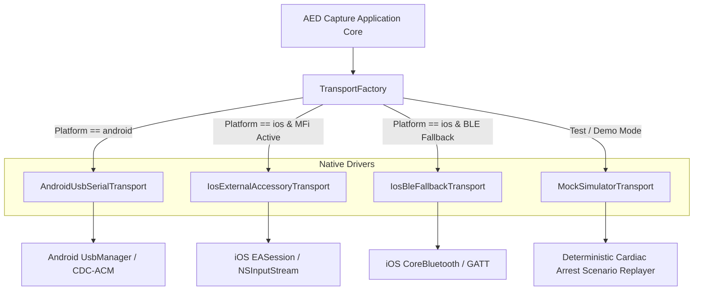

# Architecture Decision Record (ADR 001)

**Title**: Cross-Platform AED Event Capture & Logging Mobile Architecture  
**Status**: APPROVED & ACTIVE  
**Date**: 2026-09-01  
**Authors**: Lead Software Architect & Senior React Native Systems Engineer  
**Context**: Medical / Safety Event Ingestion System  

---

## 1. Executive Summary & Objective

The objective of this application is to capture real-time optical infrared (IR) diagnostic streams from Automated External Defibrillators (AEDs) via a hardware receiver dongle, decode those streams into deterministic medical/safety events (e.g., "pads connected", "analyzing rhythm", "shock advised", "shock delivered", "resume CPR"), and persist both the raw payload and structured event logs into an immutable, audit-grade repository with zero data loss under disconnection stress.

---

## 2. Hardware Context & Platform Strategy (MFi Resolution)

### 2.1 The iOS Sandbox & USB-C Reality
On Apple iOS/iPadOS, standard USB-C serial bridge ICs (such as Silicon Labs CP2102, FTDI FT232R/FT230X, WCH CH340, Prolific PL2303, or generic USB CDC-ACM devices) cannot be opened directly by third-party App Store applications via userland POSIX serial APIs. Apple restricts direct hardware communication on iOS to:
1. **Apple MFi (Made for iPhone/iPad) Program**: Peripherals containing Apple's authentication coprocessor communicating through the `ExternalAccessory.framework` with a registered `UISupportedExternalAccessoryProtocols` string (e.g., `com.manufacturer.aed-ir`).
2. **Bluetooth Low Energy (BLE)**: Peripherals advertising standard or custom GATT profiles (e.g., Nordic UART Service `6E400001-B5A3-F393-E0A9-E50E24DCCA9E`).
3. **CoreAudio / CoreMIDI**: Accessories presenting as standard audio or MIDI class devices.

On Android, standard USB OTG Host APIs (`android.hardware.usb.UsbManager` + CDC-ACM / FTDI driver) provide unrestricted direct communication with any standard USB-Serial bridge upon runtime user permission grant.

### 2.2 Platform Strategy & Decision Matrix

To ensure that core functionality is never silently degraded on any platform, we implement the following deterministic strategy:

| Capability / Flow | Android (Wired USB-C) | iOS Branch A (MFi Dongle) | iOS Branch B (Non-MFi / BLE Bridge) |
| :--- | :--- | :--- | :--- |
| **Physical Interface** | USB-C OTG Host port | Lightning / USB-C MFi Cable | BLE 5.0+ Low Energy Wireless |
| **Driver / Subsystem** | `UsbManager` + CDC/FTDI/CP210x | `EAAccessoryManager` + `EASession` | `CoreBluetooth` (`CBCentralManager`) |
| **Connection Trigger** | `android.hardware.usb.action.USB_DEVICE_ATTACHED` | `EAAccessoryDidConnectNotification` | CoreBluetooth Central scanning & auto-connect |
| **Permission Flow** | System USB Intent Permission Dialog | Automatic for paired MFi accessories | CoreBluetooth System Permission (`NSBluetoothAlwaysUsageDescription`) |
| **Reconnection Model** | USB detached/attached broadcast receiver | Accessory notification re-bind | GATT auto-reconnect with peripheral state restoration |
| **Data Ingestion** | Bulk transfer endpoint polling | `NSInputStream` delegate runloop | Characteristic `onDidUpdateValue` notification |
| **Shared Abstraction** | `ITransportService` | `ITransportService` | `ITransportService` |



---

## 3. IR Protocol Specification & Code-to-Label Table Provenance

### 3.1 Framing Specification
Incoming serial stream is framed with standard medical optical framing:
- **Preamble / Start of Frame (SOF)**: `0xAA 0x55`
- **Length Byte**: `1 byte` (Length of Payload + Command + Sequence)
- **Sequence Number**: `1 byte` (Monotonic counter `0x00 - 0xFF` for packet drop detection)
- **Command / Event Code**: `1 byte` (Event identifier)
- **Payload Data**: `N bytes` (Energy in Joules, Heart Rate BPM, Impedance Ohms, Battery %)
- **Checksum**: `1 byte` (XOR summation of Length, Sequence, Command, and Payload bytes)
- **End of Frame (EOF)**: `0x0D 0x0A` (`\r\n`)

### 3.2 Canonical Versioned Lookup Table (`aed_protocol_v1.0`)

| Code (Hex) | Canonical Semantic Label | Severity | Critical Flag | Description & Expected Data |
| :--- | :--- | :--- | :---: | :--- |
| `0x01` | `AED_POWER_ON` | `INFO` | `false` | Unit turned on, battery status in payload |
| `0x02` | `SELF_TEST_PASSED` | `INFO` | `false` | Internal diagnostics passed |
| `0x03` | `SELF_TEST_FAILED` | `CRITICAL` | `true` | Internal failure, device not rescue-ready |
| `0x10` | `PADS_DISCONNECTED` | `WARNING` | `false` | Electrode pads open circuit / not attached |
| `0x11` | `PADS_CONNECTED` | `INFO` | `false` | Pads attached to patient, impedance valid |
| `0x20` | `ANALYZING_RHYTHM` | `WARNING` | `false` | ECG rhythm analysis in progress |
| `0x21` | `MOTION_DETECTED` | `WARNING` | `false` | Patient movement artifact detected |
| `0x30` | `SHOCK_ADVISED` | `CRITICAL` | `true` | Ventricular Fibrillation / Pulseless VT detected |
| `0x31` | `NO_SHOCK_ADVISED` | `INFO` | `false` | Non-shockable rhythm (NSR, Asystole, PEA) |
| `0x32` | `CAPACITOR_CHARGING` | `WARNING` | `false` | High voltage capacitor ramping up |
| `0x33` | `SHOCK_ARMED_READY` | `CRITICAL` | `true` | Fully charged; flashing shock button active |
| `0x34` | `SHOCK_DELIVERED` | `CRITICAL` | `true` | Biphasic shock discharged (Payload: Joules, Current) |
| `0x40` | `START_CPR_PROMPT` | `INFO` | `false` | Voice prompt: Start chest compressions |
| `0x41` | `CPR_METRONOME_ACTIVE` | `INFO` | `false` | 100-120 bpm auditory guidance running |
| `0x42` | `PAUSE_CPR_REANALYSIS`| `WARNING` | `false` | CPR interval complete, prepare for re-analysis |
| `0x50` | `LOW_BATTERY_WARNING` | `WARNING` | `false` | Battery remaining capacity < 15% |
| `0xFF` | `AED_POWER_OFF` | `INFO` | `false` | Unit powered down / session concluded |
| *Other*| `UNKNOWN_EVENT` | `UNKNOWN` | `false` | Unrecognized code; raw payload preserved byte-for-byte |

---

## 4. Storage Architecture (Dual-Write, Write-Once, Read/Write Separation)

### 4.1 Dual-Write Architecture

```
Incoming Valid Frame
       │
       ├──────────────────────────────────────────────┐
       ▼                                              ▼
[Stream Append]                                [Structured Insert]
Raw File Storage:                              SQLite Database (WAL Mode):
`sessions/{sessionId}/raw_stream.rawlog`       `events` table & `sessions` table
(Strict byte-for-byte unmodified stream)       (Indexed queryable relational events)
```

1. **Raw Log Store**: Synchronously appends each packet's binary/hex bytes with a monotonic timestamp prefix to a flat file on local sandboxed disk storage. Upon session close, a **SHA-256 integrity hash** is generated over the entire file and committed into the session manifest.
2. **Relational Event Store**: High-performance SQLite instance (via `op-sqlite` / SQLite3) configured with Write-Ahead Logging (`PRAGMA journal_mode = WAL;`) and synchronous disk flushing (`PRAGMA synchronous = NORMAL;`).

### 4.2 Database Schema (`schema.sql`)

```sql
-- Session metadata table
CREATE TABLE IF NOT EXISTS aed_sessions (
    session_id TEXT PRIMARY KEY NOT NULL,
    start_timestamp INTEGER NOT NULL,
    end_timestamp INTEGER,
    status TEXT NOT NULL CHECK(status IN ('ACTIVE', 'COMPLETED', 'INTERRUPTED')),
    transport_type TEXT NOT NULL,
    device_info TEXT,
    event_count INTEGER DEFAULT 0,
    critical_event_count INTEGER DEFAULT 0,
    raw_log_path TEXT NOT NULL,
    sha256_checksum TEXT
);

-- Structured immutable events table
CREATE TABLE IF NOT EXISTS aed_events (
    event_id TEXT PRIMARY KEY NOT NULL,
    session_id TEXT NOT NULL,
    sequence_number INTEGER NOT NULL,
    timestamp INTEGER NOT NULL,
    iso_timestamp TEXT NOT NULL,
    event_code TEXT NOT NULL,
    label TEXT NOT NULL,
    severity TEXT NOT NULL CHECK(severity IN ('CRITICAL', 'WARNING', 'INFO', 'UNKNOWN')),
    critical INTEGER NOT NULL CHECK(critical IN (0, 1)),
    raw_payload_hex TEXT NOT NULL,
    checksum_valid INTEGER NOT NULL CHECK(checksum_valid IN (0, 1)),
    metadata_json TEXT,
    FOREIGN KEY(session_id) REFERENCES aed_sessions(session_id)
);

-- Indexes for zero-latency queries during review and export
CREATE INDEX IF NOT EXISTS idx_events_session ON aed_events(session_id, sequence_number ASC);
CREATE INDEX IF NOT EXISTS idx_events_critical ON aed_events(session_id, critical);
CREATE INDEX IF NOT EXISTS idx_sessions_start ON aed_sessions(start_timestamp DESC);

-- DATABASE-LEVEL IMMUTABILITY ENFORCEMENT:
-- Reject any UPDATE or DELETE on events table via SQL Triggers
CREATE TRIGGER IF NOT EXISTS prevent_event_update
BEFORE UPDATE ON aed_events
BEGIN
    SELECT RAISE(FAIL, 'AUDIT VIOLATION: aed_events records are strictly immutable and cannot be updated.');
END;

CREATE TRIGGER IF NOT EXISTS prevent_event_delete
BEFORE DELETE ON aed_events
BEGIN
    SELECT RAISE(FAIL, 'AUDIT VIOLATION: aed_events records are strictly immutable and cannot be deleted.');
END;
```

### 4.3 Structural Separation of Repositories

- **`SessionWriteRepository`**:
  - Exposes ONLY: `createSession()`, `appendRawChunk()`, `insertEvent()`, `finalizeSession()`.
  - Used exclusively by `SessionManager` during real-time capture.
- **`SessionReadRepository`**:
  - Exposes ONLY: `listSessions()`, `getSessionById()`, `getEventsForSession()`, `exportSessionBundle()`.
  - Has zero mutation methods, guaranteeing architectural immutability.

---

## 5. Fault Tolerance & Zero Data Loss Guarantee

1. **Accidental Disconnect Handling**:
   - When the dongle is unplugged mid-session, the `SessionManager` enters `DETACHED_WAITING_RECONNECT` state.
   - The active `session_id` remains open for a configurable grace window (default: 60 seconds).
   - Any buffered data in transit is flushed immediately.
   - If reconnected within the window, parsing resumes on the same `session_id` seamlessly.
2. **Power Outage / App Crash Recovery**:
   - The raw `.rawlog` file and SQLite WAL guarantee uncorrupted persistence up to the very last received frame.
   - On next app launch, any session with status `ACTIVE` is audited, finalized, and marked `INTERRUPTED` with an accurate computed checksum.
